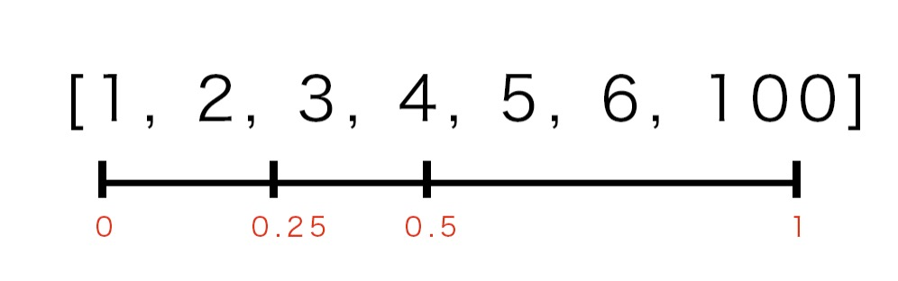

# D3 v5 API难点解析

开始学习 D3 v5 版本的 api，一般的 api 看看文档写个 Demo 就差不多明白了，但有些 api 涉及的知识比较偏，或者是需要一些专业知识来加以理解，所以本文会记录下这些相对来说比较难理解的点，以便日后再次查阅。

## d3-array

> API 文档：https://d3js.org.cn/document/d3-array/

### d3.quantile && d3.median

`d3.quantile` 的定义：返回指定 有序数组 的 p-分位数, `p` 是 [0, 1] 之间的小数。

`有序数组` 指的是需要用户自行做递增排序，这样得到的结果才符合预期
```js
d3.quantile([4, 2, 7, 3, 5, 1, 6].sort(d3.ascending), 0.25); // 输出： 2.5
```

`p-分位数` 的意思是把数组的看成是 [0, 1] 的区间，取 `p` 位置通过计算得到的对应数值



`d3.median` 赞同于 `p = 0.5`，它取的值叫中位数，意思是在这组数据中，有一半的数据比他大，有一半的数据比他小

示例代码
```js
d3.quantile([1, 2, 3, 4, 5, 6, 7], 0.25); // 输出： 2.5
d3.quantile([1, 2, 3, 4, 5, 6, 7], 0.5); // 输出： 4
d3.median([1, 2, 3, 4, 5, 6, 7]); // 输出： 4
d3.quantile([4, 2, 7, 3, 5, 1, 6], 0.25); // 输出： 4.5
d3.quantile([4, 2, 7, 3, 5, 1, 6].sort(d3.ascending), 0.25); // 输出： 2.5
d3.quantile([4, 2, 7, 3, 5, 1, 6].sort(d3.descending), 0.25); // 输出： 5.5
```

### d3.variance && d3.deviation

`d3.variance` 的定义是求样本方差，`d3.deviation` 的定义是求标准差，其中*方差是实际值与期望值之差平方的平均值，而标准差是方差算术平方根*。

百度百科对方差的定义如下：

> 方差是和中心偏离的程度，用来衡量一批数据的波动大小（即这批数据偏离平均数的大小）并把它叫做这组数据的方差，记作S2。 在样本容量相同的情况下，方差越大，说明数据的波动越大，越不稳定。

计算公式，其中，x表示样本的平均数，n表示样本的数量，xi表示样本个体


以 `[1, 2, 3, 4, 5, 99]` 来演示下计算过程

```js
数组
[1, 2, 3, 4, 5, 99]

平均值
d3.mean([1, 2, 3, 4, 5, 99]) = 19

实际值与期望值之差的平方
[
    1 ==>> 1 - 19 = -18 ==>> -18 * -18 = 324
    2 ==>> 2 - 19 = -17 ==>> -17 * -17 = 289
    3 ==>> 3 - 19 = -16 ==>> -16 * -16 = 256
    4 ==>> 4 - 19 = -15 ==>> -15 * -15 = 225
    5 ==>> 5 - 19 = -14 ==>> -14 * -14 = 196
    99 ==>> 99 - 19 = 80 ==>> 80 * 80 = 6400
]

平方值的平均值(根据公式，需要 样本总数-1)
324 + 289 + 256 + 225 + 196 + 6400 = 7690 ==>> 7690 / (6 - 1) = 1538

对比方差api的结果
d3.variance([1, 2, 3, 4, 5, 99]); 输出 1538

标准差的计算方式
Math.sqrt(1538) = 39.21734310225516

对比标准差api的结果
d3.deviation([1, 2, 3, 4, 5, 99]); 输出 39.21734310225516
```

### d3.bisectLeft && d3.bisectRight && d3.bisect

`d3.bisectLeft` 的定义是：对一个 排序的数组 进行二分查找，获取某数组项左边的位置索引，`d3.bisectRight` 取右边的位置索引，`d3.bisect` 等同于 `d3.bisectRight`

这里 `排序的数组` 必须是一个用户自行处理的 `递增排序` 数组，否则输出的结果完全是错的

如果查找项在数组中存在
- `d3.bisectLeft` 返回此位置的左边索引
- `d3.bisectRight` `d3.bisect`  返回此位置的右边索引

如果查找项在数组中不存在，则都返回第一个大于此项的值的左边索引

示例代码
```js
d3.bisectLeft([3, 2, 1, 7, 4, 5].sort(d3.ascending), 5); // 输出： 4
d3.bisectRight([3, 2, 1, 7, 4, 5].sort(d3.ascending), 5); // 输出： 5
d3.bisect([3, 2, 1, 7, 4, 5].sort(d3.ascending), 5); // 输出： 5
d3.bisectLeft([3, 2, 1, 7, 4, 5].sort(d3.ascending), 6); // 输出： 5
d3.bisectRight([3, 2, 1, 7, 4, 5].sort(d3.ascending), 6); // 输出： 5
d3.bisect([3, 2, 1, 7, 4, 5].sort(d3.ascending), 6); // 输出： 5
```

`d3.bisectLeft(array, x[, lo[, hi]]) ` 通过 lo 和 hi 参数可以控制输出索引的范围，如果小于 `lo` 则输出 `lo`，如果大于 `hi` 则输出 `hi`

示例代码
```js
d3.bisectLeft([3, 2, 1, 7, 4, 5].sort(d3.ascending), 3, 3, 5); // 输出： 3
d3.bisectLeft([3, 2, 1, 7, 4, 5].sort(d3.ascending), 3); // 对比输出： 2
d3.bisectLeft([3, 2, 1, 7, 4, 5].sort(d3.ascending), 7, 3, 4); // 输出： 4
d3.bisectLeft([3, 2, 1, 7, 4, 5].sort(d3.ascending), 7); // 对比输出： 5
```

## 参考资料

- https://www.jb51.net/article/160968.htm
- https://baike.baidu.com/item/%E6%96%B9%E5%B7%AE
- https://www.twblogs.net/a/5b80605a2b71772165a744c0
