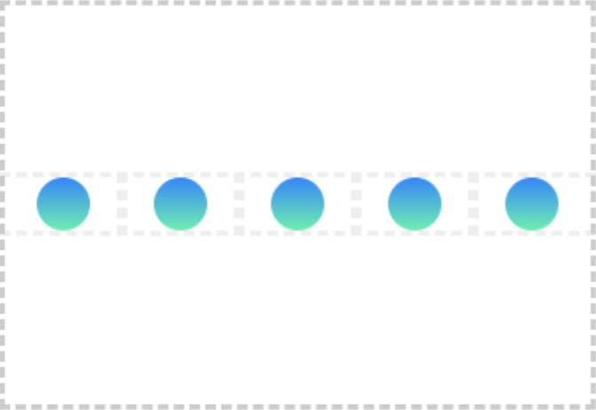
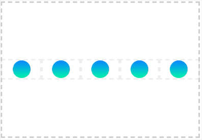
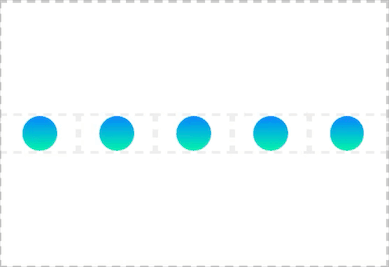
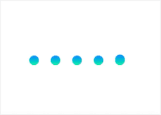

# Loading动效实现背后的思考过程

有一个制作Loading动效的需求，设计师从AE导出了动画JSON数据，但需要加载 [lottie-web](https://github.com/airbnb/lottie-web) 才能播放，考虑到这种小动效并不是业务中的常见需求，所以我不打算引入 `lottie-web`，而是直接根据动画效果自己用CSS写一个，记录动效实现的思考过程。

## 动效原型


## 观察细节

- 竖线自始至终只是高度的变化，位置上保持垂直居中，动画时长1秒；
- 坚线有上下渐变效果；
- 从左到右的过程具有波浪效果；
- 动画的开始到结束是一个整体，只有最后一个竖线的动画结束之后才会开始下一轮动画；
- 每根竖线动画结束的时间都比它前一根要晚一点；
- 动画结束后会展示一段时间5个圆点并排停留的效果；

## 实现过程

### 1、静态样式

```css
.loading,
.loading > span {
    position: relative;
    box-sizing: border-box;
}
.loading {
    font-size: 0;
    margin: auto;
    position: absolute;
    top: 0; left: 0; bottom: 0; right: 0;
    width: 100px;
    height: 75px;
    line-height: 75px;

}

.loading > span {
    display: inline-block;
    width: 8px;
    height: 8px;
    margin: 0 6px;
    border-radius: 4px;
    vertical-align: middle;
    background-image: linear-gradient(0deg, #00F4AA 0%, #0E85FF 100%);
}
```



### 2、实现波浪效果

一般的波浪效果实现上都是通过 `animate-delay` 让每根竖线延迟开始动画，但这里动画从开始到结束是一个整体，所以这里我们通过为每个竖线独立设置动画进度来实现，让它们间隔 `1/5秒` 的时间高度拉伸到最大，注意这里使用了缓动函数 `ease`，会让过渡更自然。

```css
.loading > span:nth-child(1) { animation: loadingAnim1 1s infinite ease; }
.loading > span:nth-child(2) { animation: loadingAnim2 1s infinite ease; }
.loading > span:nth-child(3) { animation: loadingAnim3 1s infinite ease; }
.loading > span:nth-child(4) { animation: loadingAnim4 1s infinite ease; }
.loading > span:nth-child(5) { animation: loadingAnim5 1s infinite ease; }

/*
* Animation
*/
@keyframes loadingAnim1 {
    0% { height: 10px; }
    10% { height: 75px; }
    100% { height: 10px; }
}
@keyframes loadingAnim2 {
    0% { height: 10px; }
    20% { height: 75px; }
    100% { height: 10px; }
}
@keyframes loadingAnim3 {
    0% { height: 10px; }
    30% { height: 75px; }
    100% { height: 10px; }
}
@keyframes loadingAnim4 {
    0% { height: 10px; }
    40% { height: 75px; }
    100% { height: 10px; }
}
@keyframes loadingAnim5 {
    0% { height: 10px; }
    50% { height: 75px; }
    100% { height: 10px; }
}
```



### 3、设置不同的高度

```
loadingAnim1 >>设置>> 10% { height: 20px; }
loadingAnim2 >>设置>> 20% { height: 38px; }
loadingAnim2 >>设置>> 30% { height: 75px; }
loadingAnim4 >>设置>> 40% { height: 38px; }
loadingAnim5 >>设置>> 50% { height: 20px; }
```



### 4、设置动画结束时间间隔

每根竖线间隔 `1/5秒` 的时间结束动画。

```
loadingAnim1 >>设置>> 60% { height: 10px; }
loadingAnim2 >>设置>> 70% { height: 10px; }
loadingAnim3 >>设置>> 80% { height: 10px; }
loadingAnim4 >>设置>> 90% { height: 10px; }
loadingAnim5 >>设置>> 100% { height: 10px; }
```


### 5、结束后的并排停留的效果

要实现这种效果，只要让所有动画结束时间提前0.1秒，这样它会保持0.1秒的静止效果。

```
loadingAnim1 >>设置>> 50% { height: 10px; }
loadingAnim2 >>设置>> 60% { height: 10px; }
loadingAnim3 >>设置>> 70% { height: 10px; }
loadingAnim4 >>设置>> 80% { height: 10px; }
loadingAnim5 >>设置>> 90% { height: 10px; }
```

### 6、最终样式

```css
.loading,
.loading > span {
    position: relative;
    box-sizing: border-box;
}
.loading {
    font-size: 0;
    margin: auto;
    position: absolute;
    top: 0; left: 0; bottom: 0; right: 0;
    width: 100px;
    height: 75px;
    line-height: 75px;

}

.loading > span {
    display: inline-block;
    width: 8px;
    height: 8px;
    margin: 0 6px;
    border-radius: 4px;
    vertical-align: middle;
    background-image: linear-gradient(0deg, #00F4AA 0%, #0E85FF 100%);
}
    
.loading > span:nth-child(1) { animation: loadingAnim1 1s infinite ease; }
.loading > span:nth-child(2) { animation: loadingAnim2 1s infinite ease; }
.loading > span:nth-child(3) { animation: loadingAnim3 1s infinite ease; }
.loading > span:nth-child(4) { animation: loadingAnim4 1s infinite ease; }
.loading > span:nth-child(5) { animation: loadingAnim5 1s infinite ease; }

/*
* Animation
*/
@keyframes loadingAnim1 {
    0% { height: 10px; }
    10% { height: 20px; }
    50% { height: 10px; }
}
@keyframes loadingAnim2 {
    0% { height: 10px; }
    20% { height: 38px; }
    60% { height: 10px; }
}
@keyframes loadingAnim3 {
    0% { height: 10px; }
    30% { height: 75px; }
    70% { height: 10px; }
}
@keyframes loadingAnim4 {
    0% { height: 10px; }
    40% { height: 38px; }
    80% { height: 10px; }
}
@keyframes loadingAnim5 {
    0% { height: 10px; }
    50% { height: 20px; }
    90% { height: 10px; }
}
```

## 最终效果展示



[查看在线Demo](http://gafish.github.io/demo/loading.html)