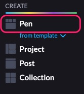
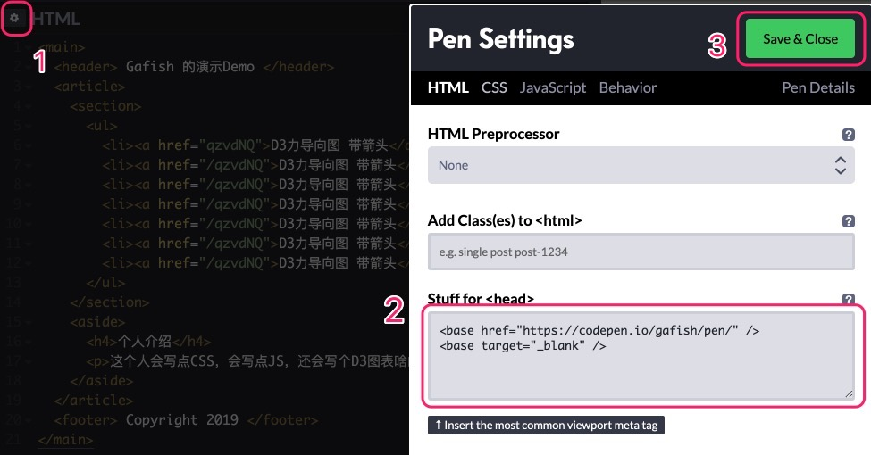
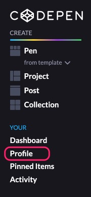
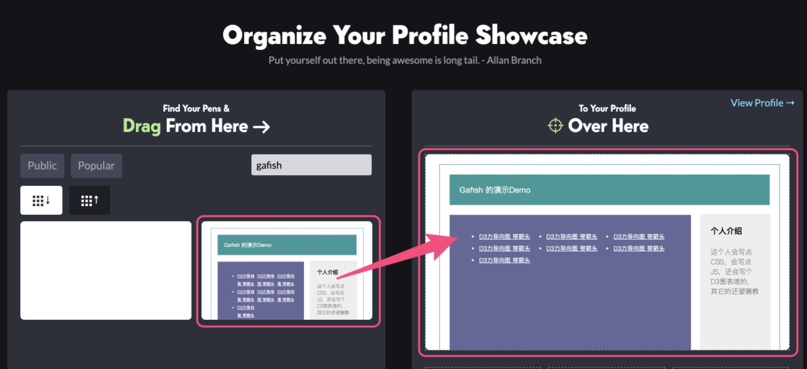
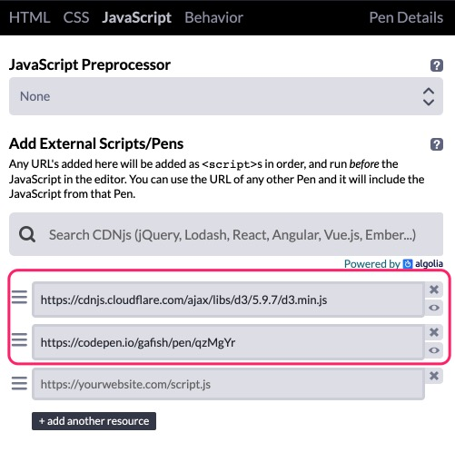
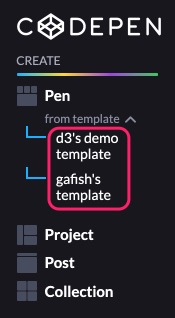
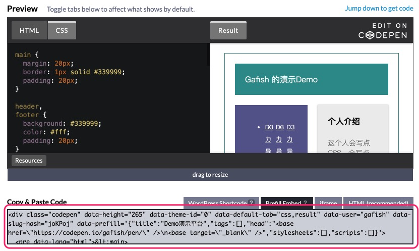
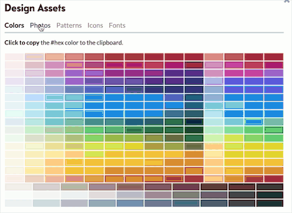

# 利用 CodePen 打造个人Demo演示平台

【写给前端新人的经验分享】

学习前端开发的过程中免不了要写一些Demo来验证和实践学到的知识，常见的做法就是在自己电脑上建一个文件夹专门用来存放Demo，简单快速，但不利于分享和传播，所以很多人都会选择一些在线Demo网站，如 JSFiddle、JSBin、CodePen，各平台都有自己的优势，看个人喜好选择，但要注意的是 JSFiddle 在国内被墙，基本上就不要考虑了，JSBin 非常简捷明了，我个人还是比较喜欢的，CodePen 上有非常多其它分享的 Demo 可以查看，更像一个分享社区。最后我选择并推荐 CodePen 来作为自己的 Demo 演示平台，有以下几个原因：

- 它是一个 Demo 分享社区；
- 它提供的第三方CDN更新更全；
- 它可以引用自己创建的通用JS函数和CSS；
- 它可以创建模板；

说了这么多好处，其实最重要的原因是.......习惯了 ( ͡° ͜ʖ ͡°) (๑>◡<๑) 

那就跟我一起开始吧

## 1、创建一个Demo主页

进入 [https://codepen.io/](https://codepen.io/)，从左侧菜单选择 Pen 来创建一个新的 Pen 编辑器



页面 HTML 和 CSS 根据自己的喜好来写，这个页面主要是用来放 demo 链接列表，由于每个链接的 url 都是固定的形式，同时我们也希望所有链接都是新窗口打开，所以设置一下 base 标签

```html
<base href="https://codepen.io/gafish/pen/" />
<base target="_blank" />
```

打开 HTML 的设置，在 `Stuff for <head>` 中加入上面的代码，点保存



写好主页的代码好之后，最好编辑一下页面标题，CodePen 每30秒会自动保存一次当前代码，你也可以手动点保存按钮，


进入到个人主页，选择 `Organize Showcase` ，




将刚才创建好的 Demo主页 拖动到右侧最大的展示区域，它会自动保存当前的操作，再返回个人主页，就会看到它显示在最显眼的位置



你可以查看我的 [Demo演示主页](https://codepen.io/gafish/full/joKPoj) 作为参考

## 2、创建一个通用JS和CSS库

再创建一个新的 Pen 编辑器，用来放一些通用JS和CSS，比如工具函数和基本布局样式等，这里定义的方法和样式将会和其它 demo 页面共用，为了避免命名冲突，建议所有JS方法都放到一个统一的对象里，CSS命名使用 `g_` 前缀，保存之后复制这个 pen 的访问地址备用，如 `https://codepen.io/gafish/pen/qzMgYr`

JS
```js
const _utils_ = {
    generateMockData: () => { ... }
};
```

CSS
```css
.g_main { ... }
```

## 3、创建一个demo模板

再创建一个新的 Pen 编辑器，用来作为某些 demo 的模板使用，可以预先设置好基础的 `HTML`、`CSS`、`JS`，点击顶部的 `Setting`，再点击 `Template`，这个 Pen 就被设置为了模板，可以在模板选择下拉列表中看到。


在当前设置界面切换到 `CSS` `JavaScript` 分别将刚才复制的 通用JS和CSS库 的 Pen 地址填入底部的资源输入框中，同时你可以根据需要增加一些其它设置，比如像 `jQuery` `D3` 这样的常用库的 `CDN`，点击保存。



## 4、开始第一个demo

从模板选择下拉列表中选择你需要的模板，马上就会生成一个跟模板一模一样的 Pen 编辑器，接下来就是你尽情写 Demo 的时间，最后不要忘了把写好的 Demo 加入到之前创建的 Demo主页



## 5、Fork一个demo

如果觉得其它人的 Demo 写的不错，可以点击 Fork 变成自己的，或者是想复制一下自己之前写的 Demo，Fork 一下就是一个新的 Demo


## 6、嵌入demo到博客

可以把写好的 Demo 嵌入到任何 WordPress 或者其它任何支持 HTML 插入的博客或平台，在 Pen 编辑器底部选择 `Embed`，在打开弹层里底部会有4种嵌入方式，我比较推荐使用 `Prefill Embed`，好处在于它既可以直接预览当前保存在 CodePen 上的代码，也可以在嵌入的位置修改显示内容。



至此，属于你个人的Demo演示平台就搭建好了。

CodePen 上还有很多好用的实用的功能等着你来发现，文章的最后发一个彩蛋，你知道这么多实用的资源在哪可以找到吗？


